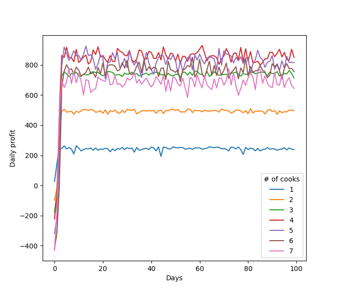
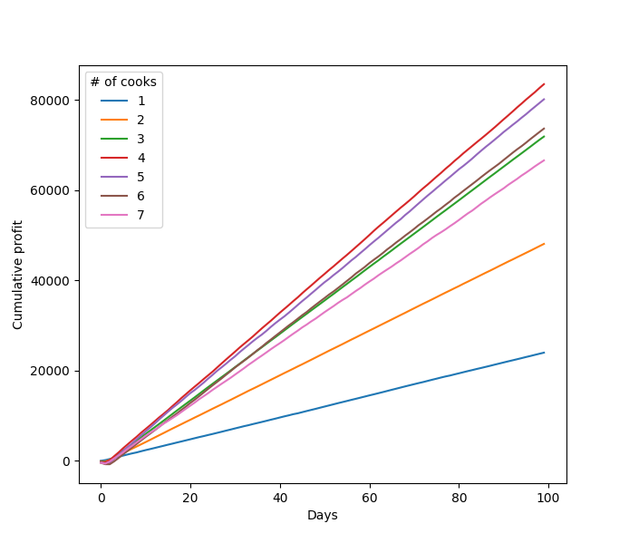

# OOP Lab 5

## Model execution
Given these initial conditions:

``` python
WAITERS_COUNT = 1
TABLES_COUNT = 20
START_HOUR = 8
END_HOUR = 20
CLOSING_HOUR = 19
INITIAL_RATING = 4.0
INITIAL_RATINGS_COUNT = 10
INITIAL_POPULARITY = 10 # number of customers daily
COOK_SALARY = 80.0
```

The model produces the following results:





From the second plot, it's clear that the optimal number of cooks for given initial conditions is **4**.
