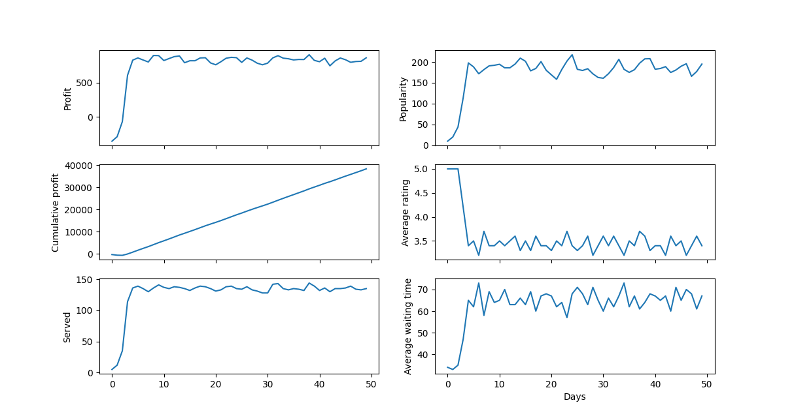
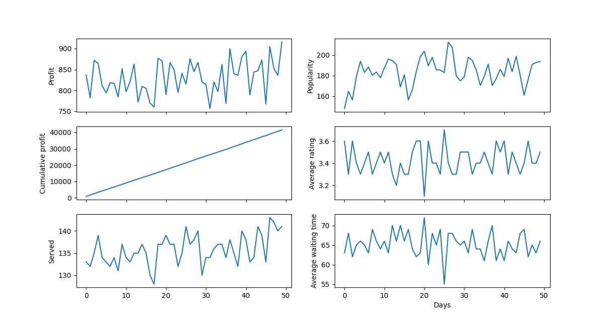
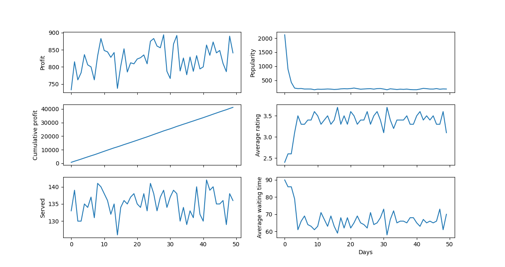

# OOP Lab 5

## Model execution
Given these initial conditions

``` python
DAYS=50
COOKS_COUNT=5
WAITERS_COUNT=1
TABLES_COUNT=20
INITIAL_RATING=4.0
INITIAL_RATINGS_COUNT=100
INITIAL_POPULARITY=20000
COOK_SALARY=80.0
SHOW_STATS=0
```

Let's see how the model reacts to different values for `INITIAL_POPULARITY`.







We can see that in every case, the system stabilizes pretty fast at the same popularity of about `180` and oscillates between `160` and `200`.
