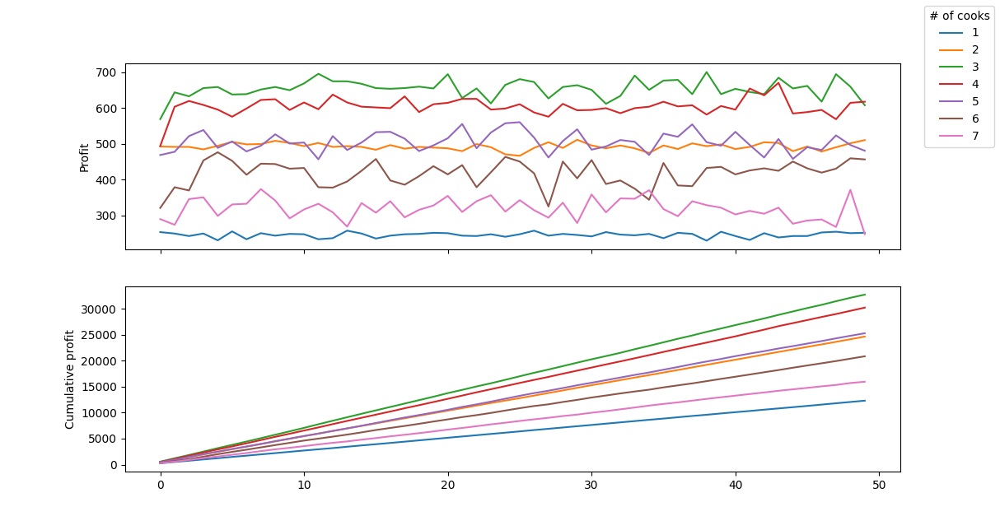
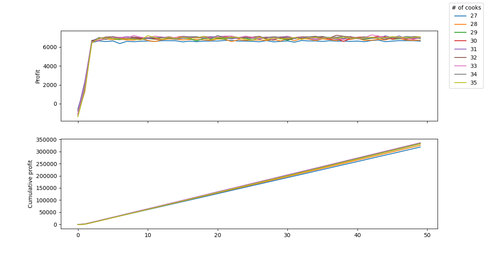
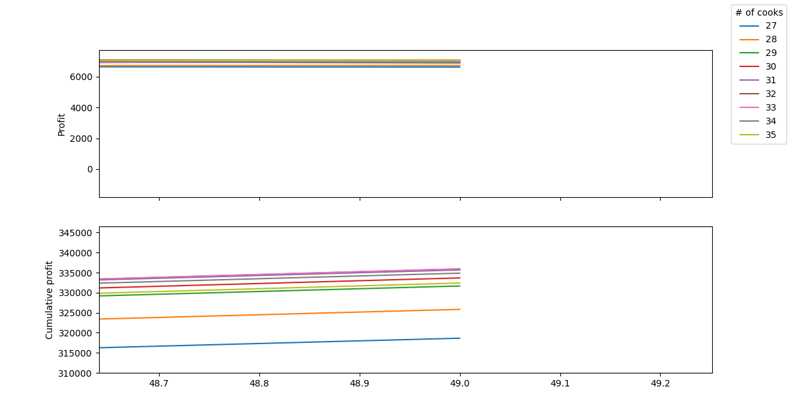

# OOP Lab 5
## Results
### Popularity over time
One question we might ask is 
> How does the system evolve given some particular initial parameters?

Specifically, we can look at how the number of customers changes over time,
and compare different situations:
- it's a new restaurant and only a handful of people know about it
- the restaurant recently got lots of recognition due to a very successful ad

So, given these initial conditions

``` python
DAYS=50
COOKS_COUNT=5
WAITERS_COUNT=1
TABLES_COUNT=20
COOK_SALARY=80.0
```

Let's see how the model reacts to different values for `INITIAL_POPULARITY`.

For `INITIAL_POPULARITY=10`:


For `INITIAL_POPULARITY=5000`:


We can see that in every case, the system stabilizes pretty fast at the same popularity of about `180` and oscillates between `160` and `200`.

Of course, if we set `INITIAL_POPULARITY=180` right away, then the system doesn't evolve at all:


### Optimal number of cooks
Another interesting question we might ask, is 
> What is the optimal number of cooks given a number of tables?

Of course, optimal in this case means maximizing profits.

So, let's see what's the optimal number of cooks for a small restaurant with 10 tables,
that has these initial conditions:

``` python
DAYS=50
MIN_COOKS=27
MAX_COOKS=35
COOKS_INTERVAL=1
WAITERS_COUNT=1
TABLES_COUNT=10
INITIAL_POPULARITY=180
COOK_SALARY=80.0
```



It's clear that the optimal number of cooks in this case is **3**.

What about 100 tables?
After a bit of trial and error, I arrived at this graph:


It's not very clear, but if we zoom in, we see that the optimal number of cooks is about 31-33.



Therefore we can extrapolate that our system turned out pretty linear,
requiring ≈3.2 cooks for every 10 tables,
which is not very interesting.
