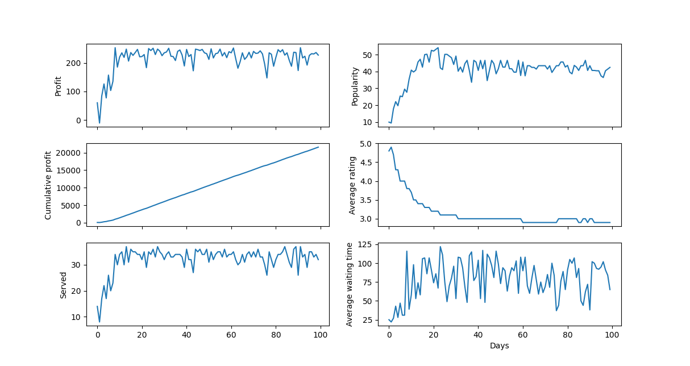
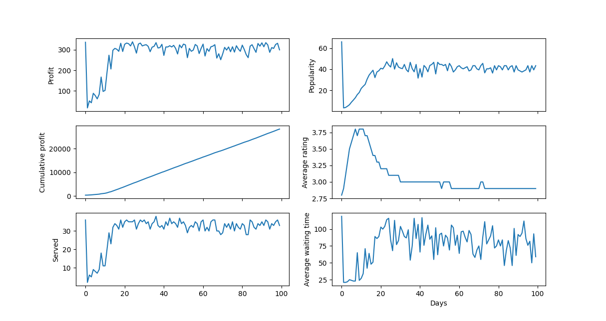
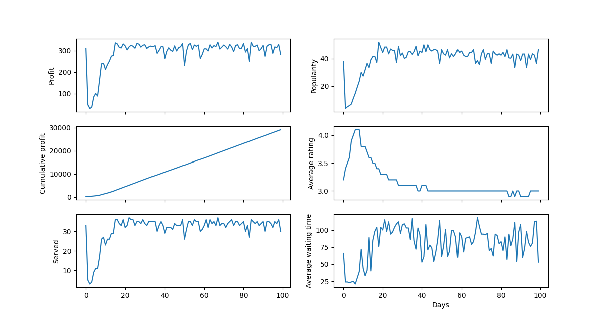
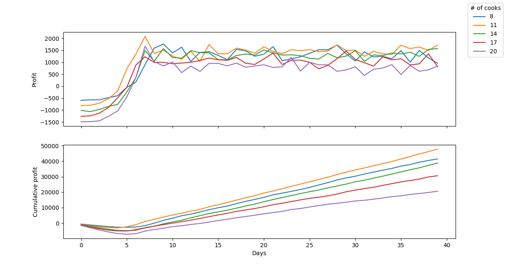

# OOP Lab 5
## Results
Once we have a working model, we can use it to analyze different scenarios and answer all sorts of interesting questions.
### Popularity over time
One question we might ask is
> How does the system evolve given some particular initial parameters?

Specifically, we can look at how the number of customers changes over time,
and compare two different situations:
- it's a new restaurant and only a handful of people know about it
- the restaurant recently got lots of recognition due to a very successful ad

So, given these initial conditions:

``` python
DAYS=100
COOKS_COUNT=1
WAITERS_COUNT=1
TABLES_COUNT=10
COOK_SALARY=80.0
SHOW_STATS=0
```

Let's see how the model behaves for different values of `INITIAL_POPULARITY`.

For `INITIAL_POPULARITY=10`, there is a steady raise in popularity,


For `INITIAL_POPULARITY=100`, popularity dips, but then settles at 40.


We can see that in each case, the system stabilizes pretty fast at the same popularity of ≈40.
Notice how in fact, all the parameters settle at about the same values.
Therefore, the system has a tendency to become stable, no matter the initial popularity.

Interestingly, if we set `INITIAL_POPULARITY=40`, instead of staying the same, the popularity dips quite a lot before recovering back to `40`. 



This probably has to do with the initially low rating count, which allows the restaurant to get too much attention which it can't handle, and most people get disappointed by the high queues, so the popularity drops dramatically.
Of course, in the real world, not every customer leaves a rating, and the popularity doesn't depend solely on the average rating.

### Optimal number of cooks
Another interesting question one might ask, is 
> What is the optimal number of cooks given a number of tables?

Of course, optimal in this case means maximizing profits.

So, let's see what's the optimal number of cooks for a small restaurant with 10 tables,
that has the following parameters:
``` python
DAYS=100
MIN_COOKS=1
MAX_COOKS=7
COOKS_INTERVAL=1
WAITERS_COUNT=2
TABLES_COUNT=10
INITIAL_POPULARITY=10
COOK_SALARY=80.0
```


It's clear that the optimal number of cooks in this case is **2**.

What about a bigger restaurant, say, 50 tables?
By tweaking the parameters so it doesn't take too long to run the simulation, I arrived at this graph:


The optimal number of cooks for 50 tables turns out to be around **11**.
Therefore we can extrapolate that our system turned out pretty linear,
requiring a cook for every ≈5 tables,
no matter how many tables,
which is not very interesting.
However, this was to be expected as the model is not very complex
and has little to no randomness involved.

## Running the simulation
To run the simulation, simply instance the model with the wanted parameters and call the `step` or `run_a_day` methods, like this:
``` ruby
require_relative 'model/Model'
model = Model.new(cooks_count: 1,
                  waiters_count: 1,
                  tables_count: 10,
                  initial_popularity: 10,
                  show_stats: true,
                  logger_level: Logger::INFO)
2.times do
  model.run_a_day
end
```

Here is an example of the output logs:
``` text
>>> Day 2 -- 18:25: Customer 860 entered restaurant.
>>> Day 2 -- 18:30: Customer 860 decided what to order.
>>> Day 2 -- 18:31: Waiter 240 took Customer 860's order.
>>> Day 2 -- 18:32: Waiter 240 left 1 orders in the order holder.
>>> Day 2 -- 18:32: Cook 260 started cooking Order 880.
>>> Day 2 -- 18:55: Cook 260 finished cooking Order 880.
>>> Day 2 -- 18:56: Waiter 240 served order to Customer 860.
>>> Day 2 -- 19:00: Starting closing. Customers can't enter anymore.
>>> Day 2 -- 19:26: Customer 860 finished eating and asked for the check.
>>> Day 2 -- 19:27: Waiter 240 billed Customer 860.
>>> Day 2 -- 19:27: Waiter 240 started cleaning the table.
>>> Day 2 -- 19:32: Waiter 240 finished cleaning the table.
+---------------------------------------+
|          Time: 20:00, Day: 2          |
+---------------------------------------+
|Customers |                    |      0|
|          |Choosing order      |      0|
|          |Waiting waiter      |      0|
|          |Waiting food        |      0|
|          |Eating              |      0|
|          |Waiting check       |      0|
|Waiters   |                    |      1|
|          |Waiting             |      1|
|          |Cleaning table      |      0|
|Cooks     |                    |      1|
|          |Waiting             |      1|
|          |Cooking             |      0|
|Tables    |                    |     10|
|          |Free                |     10|
|Served    |                    |      6|
|Profit    |                    |  56.82|
|Rating    |                    |    4.8|
+---------------------------------------+
>>> Day 3 -- 20:00: Starting day 3
>>> Day 3 -- 08:00: New popularity of the restaurant is 10.791665891967982,
 given that the rating is 4.8 and there are 500 people.
```

The model stores some interesting metrics for every simulated "day", which can be obtained in JSON:
``` json
[
  {
    "profit": 29.66000000000001,
    "served": 12,
    "avg_rating": 4.7,
    "avg_waiting_time": 25,
    "popularity": 10,
    "ratings": [5, 5, 5, 5, 5, 4, 5, 5, 4, 5, 3, 5]
  },
  {
    "profit": -25.190000000000005,
    "served": 6,
    "avg_rating": 4.6,
    "avg_waiting_time": 28,
    "popularity": 6.808690688028349,
    "ratings": [5, 5, 5, 5, 5, 4, 5, 5, 4, 5, 3, 5, 5, 5, 3, 4, 5, 5]
  },
  {
    "profit": 11.709999999999994,
    "served": 11,
    "avg_rating": 4.6,
    "avg_waiting_time": 23,
    "popularity": 8.702338013963548,
    "ratings": [5, 5, 5, 5, 5, 4, 5, 5, 4, 5, 3, 5, 5, 5, 3, 4, 5, 5, 5, 3, 5, 5, 5, 5, 4, 5, 5, 5, 3]
  }
]
```
