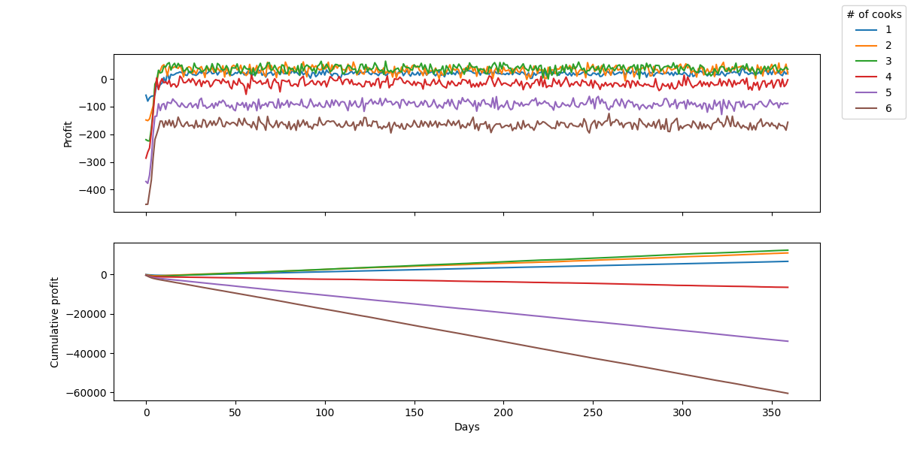

# OOP Lab 5
## Results
### Popularity over time
One question we might ask is 
> How does the system evolve given some particular initial parameters?

Specifically, we can look at how the number of customers changes over time,
and compare different situations:
- it's a new restaurant and only a handful of people know about it
- the restaurant recently got lots of recognition due to a very successful ad

So, given these initial conditions

``` python
DAYS=50
COOKS_COUNT=5
WAITERS_COUNT=1
TABLES_COUNT=20
COOK_SALARY=80.0
```

Let's see how the model reacts to different values for `INITIAL_POPULARITY`.

For `INITIAL_POPULARITY=10`:


For `INITIAL_POPULARITY=5000`:


We can see that in every case, the system stabilizes pretty fast at the same popularity of about `180` and oscillates between `160` and `200`.

Of course, if we set `INITIAL_POPULARITY=180` right away, then the system doesn't evolve at all:


### Optimal number of cooks
Another interesting question we might ask, is 
> What is the optimal number of cooks given a number of tables?

Of course, optimal in this case means maximizing profits.

So, let's see what's the optimal number of cooks for a small restaurant with 10 tables,
that has these initial conditions:

``` python
DAYS=50
MIN_COOKS=27
MAX_COOKS=35
COOKS_INTERVAL=1
WAITERS_COUNT=1
TABLES_COUNT=10
INITIAL_POPULARITY=180
COOK_SALARY=80.0
```



It's clear that the optimal number of cooks in this case is **3**.

What about 100 tables?
After a bit of trial and error, I arrived at this graph:


It's not very clear, but if we zoom in, we see that the optimal number of cooks is about 31-33.


Therefore we can extrapolate that our system turned out pretty linear,
requiring ≈3.2 cooks for every 10 tables,
which is not very interesting.

## Running the simulation
To run the simulation, simply instance the model with the wanted parameters and call the `step` or `run_a_day` methods, like this:
``` ruby
require_relative 'model/Model'
model = Model.new(cooks_count: 1,
                  waiters_count: 1,
                  tables_count: 10,
                  initial_popularity: 10,
                  show_stats: true,
                  logger_level: Logger::INFO)
2.times do
  model.run_a_day
end
```

Here is an example of the output logs:
``` text
>>> Day 2 -- 18:25: Customer 860 entered restaurant.
>>> Day 2 -- 18:30: Customer 860 decided what to order.
>>> Day 2 -- 18:31: Waiter 240 took Customer 860's order.
>>> Day 2 -- 18:32: Waiter 240 left 1 orders in the order holder.
>>> Day 2 -- 18:32: Cook 260 started cooking Order 880.
>>> Day 2 -- 18:55: Cook 260 finished cooking Order 880.
>>> Day 2 -- 18:56: Waiter 240 served order to Customer 860.
>>> Day 2 -- 19:00: Starting closing. Customers can't enter anymore.
>>> Day 2 -- 19:26: Customer 860 finished eating and asked for the check.
>>> Day 2 -- 19:27: Waiter 240 billed Customer 860.
>>> Day 2 -- 19:27: Waiter 240 started cleaning the table.
>>> Day 2 -- 19:32: Waiter 240 finished cleaning the table.
+---------------------------------------+
|          Time: 20:00, Day: 2          |
+---------------------------------------+
|Customers |                    |      0|
|          |Choosing order      |      0|
|          |Waiting waiter      |      0|
|          |Waiting food        |      0|
|          |Eating              |      0|
|          |Waiting check       |      0|
|Waiters   |                    |      1|
|          |Waiting             |      1|
|          |Cleaning table      |      0|
|Cooks     |                    |      1|
|          |Waiting             |      1|
|          |Cooking             |      0|
|Tables    |                    |     10|
|          |Free                |     10|
|Served    |                    |      6|
|Profit    |                    |  56.82|
|Rating    |                    |    4.8|
+---------------------------------------+
>>> Day 3 -- 20:00: Starting day 3
>>> Day 3 -- 08:00: New popularity of the restaurant is 10.791665891967982,
 given that the rating is 4.8 and there are 500 people.
```

The model stores some interesting metrics for every simulated "day", which can be obtained in JSON:
``` json
[
  {
    "profit": 29.66000000000001,
    "served": 12,
    "avg_rating": 4.7,
    "avg_waiting_time": 25,
    "popularity": 10,
    "ratings": [5, 5, 5, 5, 5, 4, 5, 5, 4, 5, 3, 5]
  },
  {
    "profit": -25.190000000000005,
    "served": 6,
    "avg_rating": 4.6,
    "avg_waiting_time": 28,
    "popularity": 6.808690688028349,
    "ratings": [5, 5, 5, 5, 5, 4, 5, 5, 4, 5, 3, 5, 5, 5, 3, 4, 5, 5]
  },
  {
    "profit": 11.709999999999994,
    "served": 11,
    "avg_rating": 4.6,
    "avg_waiting_time": 23,
    "popularity": 8.702338013963548,
    "ratings": [5, 5, 5, 5, 5, 4, 5, 5, 4, 5, 3, 5, 5, 5, 3, 4, 5, 5, 5, 3, 5, 5, 5, 5, 4, 5, 5, 5, 3]
  }
]
```
