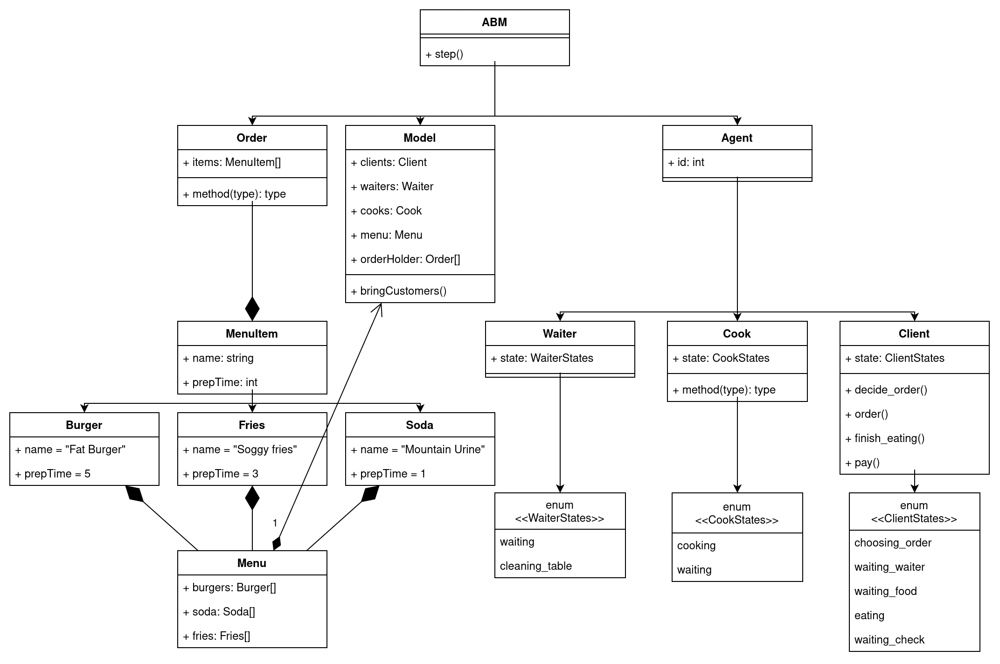
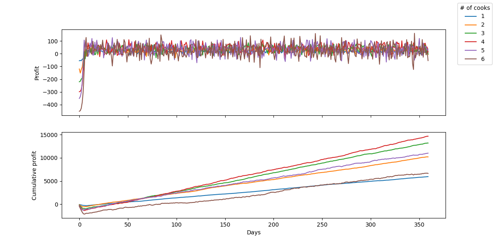

This is a [model](https://en.wikipedia.org/wiki/Agent-based_model) of a dining restaurant written in Ruby.
It is totally useless as a model, I only made it to practice my programming skills.
Moreover, it is probably a bad example of an ABM model and Ruby code in general.

I did this project at the OOP course in my uni.
The goal was to program an [agent-based model](https://en.wikipedia.org/wiki/Agent-based_model) in a radical OOP style 
(using ["the 4 pillar principles"](https://www.freecodecamp.org/news/four-pillars-of-object-oriented-programming/), SOLID, and MVC/MVC/MVVM), 
and then do some research with it, maybe answer some interesting questions.
We were free to choose the topic.
At first I intended to make a top-down arcade space shooter game (obviously I misunderstood the requirements),
but then settled for a more conservative idea - a model of a restaurant.
The other topics we were given as examples were chess, CS:GO and tower defense.
Out of these, only the last one seems related to ABM, though I doubt a tower defense "model" can answer any relevant questions.

I got the maximum grade for this project.
# Model description 
The model takes the following input parameters:
- Cooks count
- Waiters count
- Tables count
- Initial popularity (number of people that will visit the restaurant in the first day)
- Population (the maximum number of people that could come to the restaurant in a single day)
- Cook salary (measured in units of currency per day)

Aside from logs of each action that's happening internally, the model can output a list of metrics for each simulated day:
- Profit
  - How many units of currency the restaurant made that day minus the cook salary.
- Served customers count
- Average rating
- Average waiting time
  - How long customers have waited for the waiters (take their order, bring their food, bring their check) on average
- Popularity
- Ratings

## How it works
At the start of each day,
the popularity of the restaurant is decided based on the average rating.
Popularity represents the average number of customers that will arrive on that day.


Then the restaurant opens and the simulation happens in steps, once a minute. In each step, the following actions happen in this order:

- Customers arrive at different times during the day
   (according to a Poisson distribution) and take a seat if there are any free.

- Customers take their time (5 minutes) to decide what to order
  (1 burger, 0 or 1 drinks, and 1 or 2 portions of fries),
   then the waiter takes their order and puts it in the "order holder".

- Cooks take one order at a time, cook it for a number of minutes (depending on order),
  then put the food on the "ledge" when it's done, where a waiter takes it to the customer.

- After eating for 30 minutes, the customers pay the check and rate the restaurant on a 5 stars scale,
  based only on how long they waited to be served (5 stars if it they got their order right away).

- When the restaurant closes for the day,
  the cooks and waiters abort their tasks (they never leave the restaurant, lol)
  and the current day's metrics (e.g. profits) are stored.

Notes:
- Customer arrivals distribution can't be modeled accurately using Poisson,
  because the the rate is not constant ‐
  there are more customers during lunch hours,
  and much less during opening and closing.
  However, it's much simpler to use than trying to model a beta distribution with 3 spikes.

- The model assumes that the workers never take breaks and work full-time.

- Tables are really chairs in this case, now that I think of it.
In this model, people come alone and sit at their own table, alone.

## Classes
A picture is worth a thousand words, so here is the class diagram of the restaurant model:



It's not complete though, but the classes and their relationships are accurate.

# Results
Once we have a working model, we can use it to analyze different scenarios and answer all sorts of interesting questions.
## Popularity over time
One question we might ask is
> How does the system evolve given some particular initial parameters?

Specifically, we can look at how the number of customers changes over time,
and compare two different situations:
- it's a new restaurant and only a handful of people know about it
- the restaurant recently got lots of recognition due to a very successful ad

So, given these initial conditions:

``` python
DAYS=100
COOKS_COUNT=1
WAITERS_COUNT=1
TABLES_COUNT=10
COOK_SALARY=80.0
SHOW_STATS=0
```

Let's see how the model behaves for different values of `INITIAL_POPULARITY`.

For `INITIAL_POPULARITY=10`, there is a steady raise in popularity,


For `INITIAL_POPULARITY=100`, popularity dips, but then also settles at 40.


We can see that in each case, the system stabilizes pretty fast at the same popularity of ≈40.
Notice how in fact, all the parameters settle at about the same values.
Therefore, the system has a tendency to become stable, no matter the initial popularity.

Interestingly, if we set `INITIAL_POPULARITY=40`, instead of staying the same, the popularity dips quite a lot before recovering back to `40`. 


This probably has to do with the initially low rating count, which allows the restaurant to get too much attention which it can't handle, and most people get disappointed by the high queues, so the popularity drops dramatically.
Of course, in the real world, not every customer leaves a rating, and the popularity doesn't depend solely on the average rating.

## Optimal number of cooks
Another interesting question one might ask, is 
> What is the optimal number of cooks given a number of tables?

Of course, optimal in this case means maximizing profits.

So, let's see what's the optimal number of cooks for a small restaurant with 10 tables,
that has the following parameters:
``` python
DAYS=100
MIN_COOKS=1
MAX_COOKS=7
COOKS_INTERVAL=1
WAITERS_COUNT=2
TABLES_COUNT=10
INITIAL_POPULARITY=10
COOK_SALARY=80.0
```


It's clear that the optimal number of cooks in this case is **2-3**.

What about a bigger restaurant with, say, 50 tables?
By tweaking the parameters so it doesn't take too long to run the simulation, I arrived at this graph:


The optimal number of cooks for 50 tables turns out to be **4**.
This is a bit unexpected, as one would think that for 5 times the number of tables,
you would need about 5 times the number of cooks.

This model is probably very inaccurate, I suspect due to the whole popularity functionality.
In the real world, the number of people coming to a restaurant doesn't correlate that much with the number of people who came in the previous day.

# Running the simulation
The inputs can be passed to the model in two ways.
## Directly in code
To run the simulation, simply instance the model with the wanted parameters and call the `step` or `run_a_day` methods, like this:
``` ruby
require_relative 'model/Model'
model = Model.new(cooks_count: 1,
                  waiters_count: 1,
                  tables_count: 10,
                  initial_popularity: 10,
                  show_stats: true,
                  logger_level: Logger::INFO)
2.times do
  model.run_a_day
end
```
## Using environment variables
The parameters can be passed in using environment variables, which enables scripting.
For example, the `./src/question1` file runs the simulation given a set of input parameters,
and then passes the output JSON to a python script which draws the graphs seen previously.
## Output
There are two forms of output from the model: logs and daily metrics in JSON.
### Logs
Passing `logger_level: Logger::INFO` to the model tells it to output logs that look like this:
``` text
>>> Day 2 -- 18:25: Customer 860 entered restaurant.
>>> Day 2 -- 18:30: Customer 860 decided what to order.
>>> Day 2 -- 18:31: Waiter 240 took Customer 860's order.
>>> Day 2 -- 18:32: Waiter 240 left 1 orders in the order holder.
>>> Day 2 -- 18:32: Cook 260 started cooking Order 880.
>>> Day 2 -- 18:55: Cook 260 finished cooking Order 880.
>>> Day 2 -- 18:56: Waiter 240 served order to Customer 860.
>>> Day 2 -- 19:00: Starting closing. Customers can't enter anymore.
>>> Day 2 -- 19:26: Customer 860 finished eating and asked for the check.
>>> Day 2 -- 19:27: Waiter 240 billed Customer 860.
>>> Day 2 -- 19:27: Waiter 240 started cleaning the table.
>>> Day 2 -- 19:32: Waiter 240 finished cleaning the table.
+---------------------------------------+
|          Time: 20:00, Day: 2          |
+---------------------------------------+
|Customers |                    |      0|
|          |Choosing order      |      0|
|          |Waiting waiter      |      0|
|          |Waiting food        |      0|
|          |Eating              |      0|
|          |Waiting check       |      0|
|Waiters   |                    |      1|
|          |Waiting             |      1|
|          |Cleaning table      |      0|
|Cooks     |                    |      1|
|          |Waiting             |      1|
|          |Cooking             |      0|
|Tables    |                    |     10|
|          |Free                |     10|
|Served    |                    |      6|
|Profit    |                    |  56.82|
|Rating    |                    |    4.8|
+---------------------------------------+
>>> Day 3 -- 20:00: Starting day 3
>>> Day 3 -- 08:00: New popularity of the restaurant is 10.791665891967982,
 given that the rating is 4.8 and there are 500 people.
```

### Stats in JSON 
If instead you want to analyze the output in another program, say, graph it,
you can obtain the data in JSON using the `json_daily_metrics` method.
It will return an array, with metrics for each day.

Here is an example of the output data for three simulated days:
``` json
[
  {
    "profit": 29.66000000000001,
    "served": 12,
    "avg_rating": 4.7,
    "avg_waiting_time": 25,
    "popularity": 10,
    "ratings": [5, 5, 5, 5, 5, 4, 5, 5, 4, 5, 3, 5]
  },
  {
    "profit": -25.190000000000005,
    "served": 6,
    "avg_rating": 4.6,
    "avg_waiting_time": 28,
    "popularity": 6.808690688028349,
    "ratings": [5, 5, 5, 5, 5, 4, 5, 5, 4, 5, 3, 5, 5, 5, 3, 4, 5, 5]
  },
  {
    "profit": 11.709999999999994,
    "served": 11,
    "avg_rating": 4.6,
    "avg_waiting_time": 23,
    "popularity": 8.702338013963548,
    "ratings": [5, 5, 5, 5, 5, 4, 5, 5, 4, 5, 3, 5, 5, 5, 3, 4, 5, 5, 5, 3, 5, 5, 5, 5, 4, 5, 5, 5, 3]
  }
]
```
